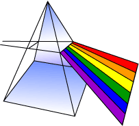

.. simpl documentation master file, created by
   sphinx-quickstart on Tue Jun 23 14:19:05 2015.
   You can adapt this file completely to your liking, but it should at least
   contain the root `toctree` directive.

Welcome to simpl's documentation!
=================================

Welcome to the documentation. We'll try to keep things simpl, so just go to
:ref:`installation` to get simpl then go to :ref:`quickstart` to see some basic
usage and examples.

.. include:: contents.rst

Indices and tables
==================

* :ref:`genindex`
* :ref:`modindex`
* :ref:`search`

